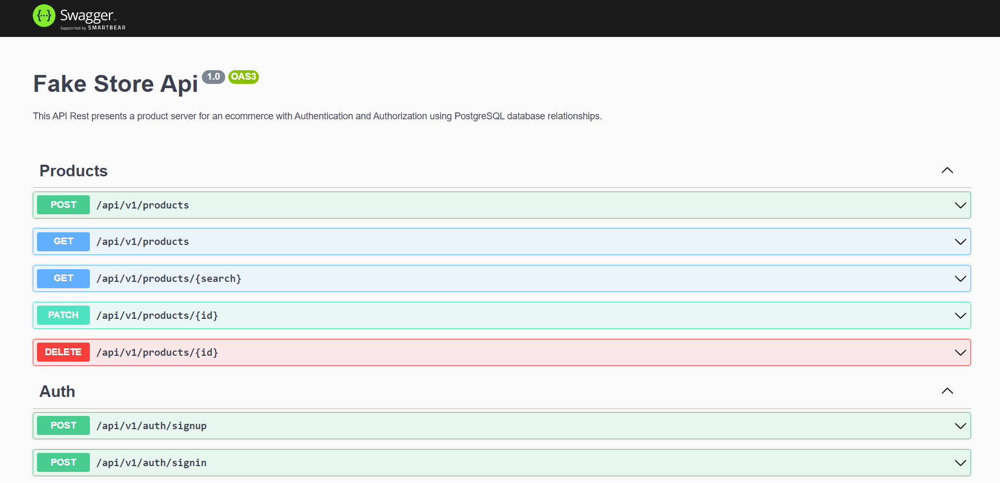

<p align="center">
  <a href="http://nestjs.com/" target="blank"></a>
</p>

[circleci-image]: https://img.shields.io/circleci/build/github/nestjs/nest/master?token=abc123def456
[circleci-url]: https://circleci.com/gh/nestjs/nest

## Description

This API Rest presents a product server for an ecommerce using PostgreSQL database relationships.

## Installation

Clone this repository

```bash
git clone https://github.com/baguilar6174/nest-store-server.git
```

Install dependencies

```bash
$ yarn
```

You need Nest CLI

```bash
$ npm i -g @nestjs/cli
```

Configure and start Database (in the root project)

```bash
docker-compose up -d
```

Clone `.env.template` file and rename to `.env`

Complete environment variables

## Running the app

```bash
# development
$ yarn start

# watch mode
$ yarn start:dev

# production mode
$ yarn start:prod
```

## Endpoints

```
Populate DB (users and products)

http://localhost:300/api/v1/seed
```

You can find all endpoints here:

```
Swagger documentation

http://localhost:3000/api
```

<table>
  <tr>
    <td>Swagger documentation</td>
  </tr>
  <tr>
    <td align="center" valign="center"></td>
  </tr>
</table>

Also you can use [`Postman Collention`](./media/postman_collection.json)

## My process

### Built with

- Nest JS
- Typescript
- PostgreSQL
- TypeORM

### What I learned

- Nest with TypeScript
- Restful APIS with PostgreSQL
- TypeORM
- Create and using Constrains
- Data validations and types
- Nest core building blocks
  - Services
  - Controllers
  - Providers
  - Decorators
  - Gateways
  - Guards
  - Interceptors
  - Exception Filters
  - Modules
- DTOs (Data Transfer Object)
- Entities and TypeORM decorators
- Class Validator
- Class Transformer
- Results pagination
- Tables relationships (one to many | many to one)
- Query Runner
- Query Builder
- Transactions
- Commits and rollbacks
- Using File System
- Authentication
- Authorization
- Json Web Tokens
- Password Hash
- Nest Passport
- Protect endpoints
- Custom Method Decorators
- Custom Class Decorators
- Custom Property Decorators
- Using Tokens
- Postman documentation
- Nest Swagger

## TODO

- Use plainToInstance to return a entity with custom fields
- Use constants (delete magic strings)
- Api documentation (using Swagger decorators)
- Refresh token endpoint
- Timestamps in entities

## Stay in touch

- Website - [www.bryan-aguilar.com](https://www.bryan-aguilar.com/)
- Medium - [baguilar6174](https://baguilar6174.medium.com/)
- LinkeIn - [baguilar6174](https://www.linkedin.com/in/baguilar6174)
